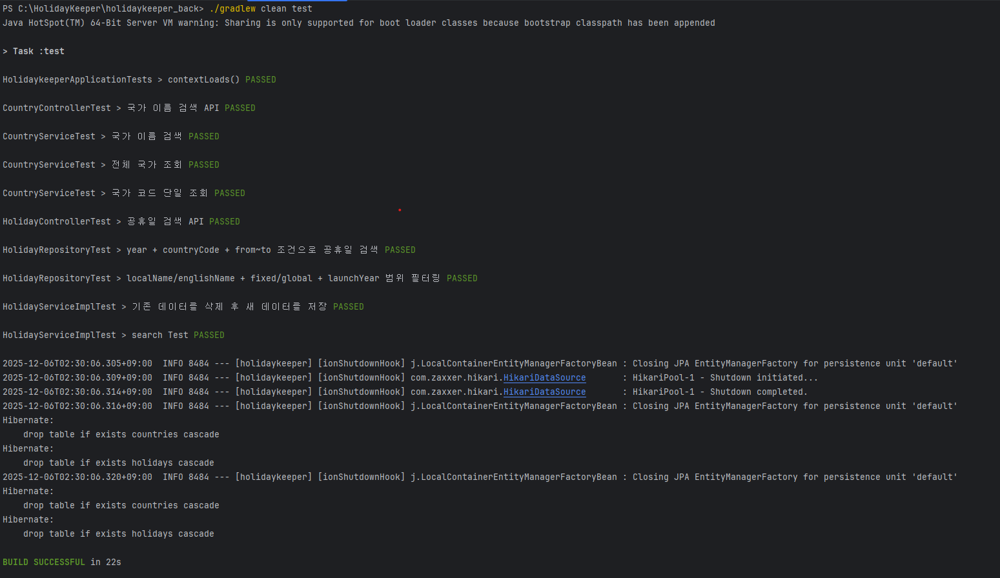
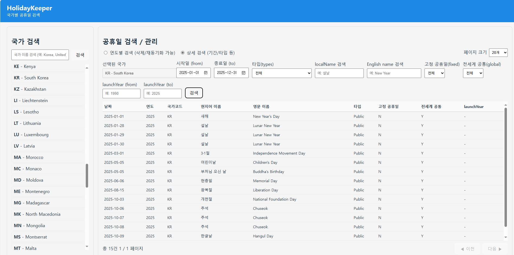

# HolidayKeeper – 공휴일 관리 서비스

PlanitSquare 채용 과제 제출을 위해 개발한 **전세계 공휴일 수집·검색·관리 서비스**입니다.  
외부 API(Nager.Date 등)를 통해 최근 5년치 공휴일을 자동 적재하고, 다양한 필터 기반 검색 및 연도별 재적재/삭제 기능을 제공합니다.  
Frontend(React) + Backend(Spring Boot) + Docker Compose 전체 구성으로 동작합니다.

---

# 1. 기술 스택

### Backend
- Jdk 21.0.9
- Spring Boot 3.4.12
- JPA / QueryDSL
- OpenAPI(Swagger)
- H2
- JUnit 5
- Gradle

### Frontend
- Node.js 22.15.1
- npm 10.9.2
- React (Vite Build)
- Axios
- nginx 정적 파일 서빙

### Infra
- Docker / Docker Compose
- Reverse Proxy (nginx)

---

# 2. 실행 방법

## 방법 1. 백엔드·프론트엔드 개별 실행

### Backend (dev)
**JDK 21 필수**
```bash
cd holidaykeeper_back
./gradlew clean test
./gradlew bootRun --args='--spring.profiles.active=prod'
#그냥 실행해도 무방합니다. profile = prod로 설정하여 git에 올렸습니다.
```

접속:  
Swagger UI → http://localhost:8080/swagger-ui/index.html  
OpenAPI JSON → http://localhost:8080/v3/api-docs

---

### Frontend (dev)
```bash
cd holidaykeeper_front
npm install
npm run dev
```

접속: http://localhost:5173

---

## 방법 2. Docker Compose 전체 실행

```bash
#프로젝트 루트 폴더에서 실행
docker compose up --build -d
```

정상 실행 후 접속:

| 서비스 | 주소 |
|--------|------|
| Backend | http://localhost:8080 |
| Frontend | http://localhost:3000 |

중지:
```bash
docker compose down
```

---

# 3. Response 구조

## 공통 Response 구조 (성공)
```json
{
  "status": 200,
  "code": "SUCCESS",
  "message": "요청이 성공했습니다.",
  "data": {}
}
```

## 에러 응답 예시
```json
{
  "status": 400,
  "code": "YEAR_001",
  "message": "연도는 2020 이상 2025 이하만 허용됩니다.",
  "data": null
}
```

## 페이지 응답 구조
```json
{
  "content": [],
  "number": 0,
  "size": 20,
  "totalElements": 120,
  "totalPages": 6
}
```

---

# 4. REST API 명세

---

## 4-1. 공휴일 검색
**GET /api/holidays**

#### 요청 파라미터

| 파라미터           | 설명                                                               |
|--------------------|--------------------------------------------------------------------|
| year               | 검색 연도 (예: 2024)                                               |
| countryCode        | 국가 코드 (예: KR)                                                 |
| from               | 시작일(YYYY-MM-DD).                     |
| to                 | 종료일(YYYY-MM-DD).                      |
| type               | 공휴일 타입 (Public, Bank, School, Observance 등 |
| fixedHoliday       | 고정 공휴일 여부 (true/false)                                     |
| globalHoliday      | 전세계 공통 여부 (true/false)                                     |
| localNameKeyword   | 현지어 이름 부분 검색                                              |
| englishNameKeyword | 영어 이름 부분 검색                                                |
| launchYearFrom     | 제정 연도 from                                                     |
| launchYearTo       | 제정 연도 to                                                       |
| page               | 페이지 번호(0부터 시작)                                            |
| size               | 페이지 크기                                                        |

### 요청 예시
```
GET /api/holidays?year=2024&countryCode=KR&page=0&size=20
```

### 응답 예시
```json
{
  "status": 200,
  "code": "SUCCESS",
  "message": "요청이 성공했습니다.",
  "data": {
    "content": [
      {
        "id": 1,
        "date": "2024-01-01",
        "holidayYear": 2024,
        "countryCode": "KR",
        "localName": "새해",
        "englishName": "New Year's Day",
        "types": ["Public"],
        "fixedHoliday": false,
        "globalHoliday": true,
        "launchYear": null
      }
    ],
    "number": 0,
    "size": 20,
    "totalElements": 50,
    "totalPages": 3
  }
}
```

---

## 4-2. 공휴일 재적재(refresh)
**PUT /api/holidays/refresh**

### 요청 예시

```
PUT /api/holidays/refresh?year=2024&countryCode=KR
```
특정 연도 + 국가 코드에 대해
1) 기존 공휴일 데이터를 삭제하고
2) 외부 공휴일 API를 다시 호출하여 최신 데이터로 재적재합니다.

### 응답 예시
```json
{
  "status": 200,
  "code": "SUCCESS",
  "message": "success",
  "data": null
}
```

---

## 4-3. 공휴일 삭제
**DELETE /api/holidays**
### 요청 예시
```
DELETE /api/holidays?year=2024&countryCode=KR
```
### 응답 예시
```json
{
  "status": 200,
  "code": "SUCCESS",
  "message": "success",
  "data": null
}
```

---

##  4-4. 국가 목록 조회
**GET /api/countries**

### 요청 예시
```
GET /api/countries
```
### 응답 예시
```json
[
  { "countryCode": "AD", "name": "Andorra" },
  { "countryCode": "KR", "name": "Korea" }
]
```

---

##  4-5. 국가 이름 검색

**GET /api/countries/search?keyword=...**

#### 요청

```http
GET /api/countries/search?keyword=ko
```

#### 응답 예시

```json
{
  "status": 200,
  "code": "SUCCESS",
  "message": "요청이 성공했습니다.",
  "data": [
    { "countryCode": "KR", "name": "Korea" },
    { "countryCode": "HK", "name": "Hong Kong" }
  ]
}
```
---

# 5. 테스트

실행:
```bash
./gradlew clean test
```

테스트 포함:
- Repository(QueryDSL) 테스트
- Service 단위 테스트
- Controller MockMvc 테스트
- PageResponse / ResponseDto 구조 검증

---

# 6. Docker 구성 요약

### Backend Dockerfile
- JDK21 기반 빌드

### Frontend Dockerfile
- Node 빌드 → nginx로 정적 파일 제공
- `/api/*` 요청 → backend 프록시 처리

### docker-compose.yml
- holiday-back
- holiday-front
- 네트워크 `holiday-net`

---

# 7. DB 설계

- **Country**
  - `countryCode` (PK)
  - `name`

- **Holiday**
  - `id` (PK)
  - `date`
  - `holidayYear`
  - `localName` / `englishName`
  - `fixedHoliday` / `globalHoliday`
  - `launchYear`
  - `types`
  - `country` (FK: Country.countryCode)

---

# 8. 비고

- 제출용(prod)은 단순 구성이며 env 분리를 하지 않았습니다.
- 연도 검증 규칙:

```
currentYear - 5 ≤ year ≤ currentYear
```

- frontend에서 날짜/launchYear 입력 시 UI 단계에서 사전 검증
- docker compose up 실행 시 전체 시스템 즉시 동작
---
##  초기 데이터 자동 적재 (DataInitRunner)

애플리케이션 최초 실행 시 아래 작업을 자동으로 수행합니다.

- **Country 테이블 비어 있을 경우**  
  → 외부 API에서 전체 국가 목록 조회 후 DB 저장
- **Holiday 테이블 비어 있을 경우**  
  → 전체 국가에 대해 최근 5년치 공휴일 일괄 적재  


---

## 매년 자동 공휴일 스케줄링

공휴일 정보를 최신 상태로 유지하기 위해 스케줄러가 설정되어 있습니다.

- 실행 시점:  
  **매년 1월 2일 새벽 1시(KST)**

- 동작 내용:  
  모든 국가에 대해 **전년도 + 금년도** 공휴일 정보를 외부 API로부터 재동기화  
  (`refreshYearAndCountry(prevYear, code)` / `refreshYearAndCountry(currentYear, code)`)

---
# 9. 실행 화면 / 테스트 스크린샷


## Backend JUnit 테스트 성공 화면




---

## Frontend 화면




